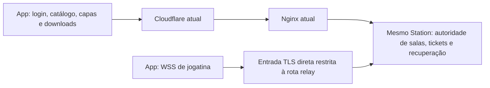

# Pesquisa de estabilidade do Station no PC atual — 07/10/2026

Pedido: procurar uma solução melhor para jogatina online preservando os
sistemas deste servidor. Consulta a fontes oficiais, comparação com fonte
R74/R75 e ensaios locais. A conclusão distingue erro reproduzido, correção
candidata, configuração ativa e hipótese de rede.

## Conclusão técnica

Há uma melhoria demonstrada sobre o comportamento atual: **corrigir a perda
de sinal de trabalho na fila do app**, mantendo um único escritor. A corrida
foi reproduzida independentemente no Linux:64/64 casos deixam DATA esperando;
o candidato entrega64/64 sem novo tick, em 1.764 verificações. Não altera ROM,
core, protocolo, autenticação, licença ou servidor. Ainda falta integrar e
qualificar essa alteração no APK. Não é medição de ganho de FPS no celular.

Do lado do servidor, corrigir a resposta de Close e capturar a primeira causa
antes de Detach são mudanças concretas preparadas. Observações limitadas de
DATA/PONG/locks/GC permitem identificar a parcela restante da demora. A DLL
nova **não foi ativada**: a qualificação TLS isolada tem um resultado
inconsistente que precisa ser resolvido. Cadastro R74 de dez engines está ativo.

Esse caminho preserva o serviço e remove defeitos identificados. Não há prova
que indique remover Cloudflare, trocar o transporte ou comprar hardware como
primeira correção. O
[retorno R74](RETORNO-SERVIDOR-APP-R74-LIFECYCLE-LATENCIA-20261007.md)
contém commits, hashes, cronologia, testes, limites e tarefas do PCAPK.

## O que a literatura confirma e como se aplica aqui

| Fonte primária | Aplicação ao Station |
|---|---|
| [Libretro: arquitetura de netplay](https://docs.libretro.com/development/retroarch/netplay/) | O netplay usa entradas por quadro e replay de estados. Dados tardios que diferem da previsão podem exigir reexecução. Entrega ordenada deve ser preservada; bytes atrasados não podem ser descartados indiscriminadamente. |
| [RxJava: QueueDrainHelper](https://raw.githubusercontent.com/ReactiveX/RxJava/3.x/src/main/java/io/reactivex/rxjava3/internal/util/QueueDrainHelper.java) | Um pedido que chega enquanto o consumidor drena precisa continuar representado até ser atendido. Esse padrão ajuda a conferir a correção de `pumpPending`; não requer migrar a aplicação para RxJava. |
| [RFC6455 §5.5.1](https://www.rfc-editor.org/rfc/rfc6455.html#section-5.5.1) e [.NET8 ManagedWebSocket](https://raw.githubusercontent.com/dotnet/runtime/v8.0.0/src/libraries/System.Net.WebSockets/src/System/Net/WebSockets/ManagedWebSocket.cs) | Responder ao Close remoto e serializar a resposta com o escritor existente, usando Abort para transporte quebrado ou finalização vencida. |
| [Cloudflare: WebSockets](https://developers.cloudflare.com/network/websockets/) | Atualizações da rede podem terminar WSS. A recomendação inclui keepalive; a aplicação precisa retomar com autenticação e o estado correto. Retirar heartbeat para esconder quedas elimina uma garantia necessária. |
| [Nginx: proxy WebSocket](https://nginx.org/en/docs/http/websocket.html) e [proxy_read_timeout](https://nginx.org/en/docs/http/ngx_http_proxy_module.html#proxy_read_timeout) | Upgrade deve ser repassado. O timeout de leitura é o intervalo entre leituras, não a duração total de uma partida. A configuração efetiva já repassa Upgrade e desliga buffering/cache. |
| [Android: cached apps freezer](https://source.android.com/docs/core/perf/cached-apps-freezer) e [BIND_IMPORTANT](https://developer.android.com/reference/android/content/Context#BIND_IMPORTANT) | Uma autoridade HTTP no processo principal pode ser congelada enquanto o processo do jogo segue ativo. Esse problema foi cruzado com logs R73 e corrigido no ciclo de vida R74; PONG não substitui heartbeat autenticado. |
| [Microsoft: ThreadPool starvation](https://learn.microsoft.com/en-us/dotnet/core/diagnostics/debug-threadpool-starvation) | CPU total baixa não descarta espera de threads. Medir fila, pausas e locks no intervalo real; usar somente APIs disponíveis em.NET8. |

A leitura das fontes não transforma hipóteses em diagnóstico. O relato de
engasgo quando ambos movimentam controles é compatível com maior trabalho de
replay, mas falta medir esse trabalho na biblioteca nativa e no mesmo período
do transporte. R74 já removeu uma escalada indevida de catch-up para NeedSync;
isso não prova que todo atraso restante venha da rede.

## Comparação das opções

| Opção | Evidência atual | Decisão |
|---|---|---|
| Corrigir sinalização da fila no APK | Erro e melhoria reproduzidos deterministicamente nas fontes exatas | Prioridade para integração e suítes completas no PCAPK |
| Responder Close no servidor | Falha de finalização identificada; nove cenários simulados e Close1000 em TLS real passaram em parte dos fixtures | Fonte pronta; resolver divergência TLS e qualificar antes de ativar |
| Medir fila/SendAsync/locks/GC/TCP | Instrumentação limitada implementada e testada sem alterar bytes/ACK/barreiras | Usar na próxima sessão após qualificação; não fabricar métricas antigas |
| Testar atraso de entrada2/0 | Opção upstream permite trocar resposta imediata por trabalho de replay | Experimento A/B medido; nenhum preset aplicado |
| Publicar apenas WSS de jogatina diretamente neste PC | Há IPv6 global, mas entrada externa e suporte dos clientes não foram comprovados; pin atual rejeita a origem | Viável somente após requisitos e comparação controlada; nenhuma rota aberta |
| Trocar para UDP/QUIC/WebRTC | Não é substituição compatível do fluxo TCP emulado e dos contratos Station | Projeto coordenado de transporte, sem ganho garantido por simples troca |
| Rodar relay libretro genérico | Não inclui as garantias Station de ticket/proof/licença/offset/barreira | Não é substituto direto do backend atual |
| Comprar GPU/servidor potente | Relay transmite dados; a emulação acontece nos celulares | GPU não foi identificada como requisito ou gargalo desse relay |

## Estudo de uma rota direta somente para jogatina

Arquitetura possível, sem implantação nesta etapa:

É necessário manter **o mesmo processo Station** como autoridade. Subir uma
segunda DLL independente perde tickets e sessões em RAM; uma rota diferente
não pode inventar uma sala equivalente. TLS, prova por pedido, ticket único,
licença/aparelho e limites permanecem necessários.

Fatos encontrados neste PC, sem publicar endereços pessoais:

- Interface física tem IPv4 privado e IPv6 global com rota de saída. IP WAN
  IPv4 do roteador não foi identificado; CGNAT continua desconhecido.
- Nginx443 escuta IPv4, sem listener443 IPv6. Station5192 permanece loopback.
  Acessibilidade de entrada pela internet não foi testada. Regras de firewall
  exigem leitura privilegiada; ter IPv6 não garante entrada liberada.
- Há endereços IPv6 dinâmicos/temporários: é necessário definir endereço
  estável e atualização DNS antes de depender de uma rota direta.
- O relay R74/R75 deriva `wss://app.lzgames.com.br/v1/station/online/relay` e
  exige confiança do sistema, hostname e pin SPKI Cloudflare
  `13f9dcbb7a9687c2f88ff73de5621cfab849d0ec02191dcdd1ee8a6275dacba7`.
- O certificado da origem foi validado localmente com hostname/confiança do
  sistema, mas seu SPKI é
  `4e0256fc2800174af2105d260cb35a0b12badd61059f4c966a9e489ca59db14a`.
  **O APK atual rejeitaria a origem direta.** URL e pin próprios exigem
  integração coordenada no app, sem desligar a verificação TLS.

Para testar de fora: conexão de entrada permitida pelo roteador/ISP, IPv4
público ou IPv6 acessível nos dois telefones, TLS apropriado, rota única com
recusa das demais rotas e cliente preparado para essa origem. O estudo não
conclui que uma porta aberta hoje esteja acessível ou protegida.
As recomendações de firewall residencial IPv6 constam do
[RFC6092](https://www.rfc-editor.org/rfc/rfc6092).

A publicação direta revela o IP e cria um caminho de tráfego para o mesmo
PC/link usado pelos outros produtos. Isolar o endpoint não isola o link de
ataques volumétricos. A própria
[Cloudflare documenta a exposição da origem](https://developers.cloudflare.com/dns/manage-dns-records/troubleshooting/exposed-ip-address/).
Somente uma comparação medida de WSS/partida, com requisitos atendidos,
justifica escolher essa rota; não é possível prometer ganho antes disso.

## Medidas encontradas e o que não permitem concluir

| Medida | Resultado | Limite |
|---|---|---|
| HTTP com conexão reutilizada, amostra histórica de nove requisições | Medianas: API local0,592ms; Nginx local0,954ms; público121,285ms | Não mede WSS, RTT dos telefones, FPS ou tempo de botão até o core remoto |
| Nova conexão pública TLS/HTTP | Mediana283,7185ms; máximo1.143,6ms | Não é custo repetido por quadro em um WSS já aberto |
| Ethernet física |100Mbps, full duplex, fq_codel já existente | Não mede upload contratado no ISP nem garante banda livre durante downloads |
| Cloudflared observado | Quatro conexões QUIC; smoothed RTT51–56ms | Métrica dessa perna e de todos os produtos; não é RTT completo da jogatina |
| CPU/memória depois da partida R74 | CPU do host majoritariamente ociosa; serviço ativo | Amostra fora da jogatina não exclui pausas/contensão durante ela |

Não foi aplicado tuning de kernel, remoção de timers, aumento de filas ou
migração de transporte. Para contenção de banda, medir latência com e sem
downloads simultâneos. SQM pode combater bufferbloat, porém exige configurar
a capacidade real do gargalo e altera a banda administrada; não foi aplicado
globalmente por hipótese. [OpenWrt SQM](https://openwrt.org/docs/guide-user/network/traffic-shaping/sqm).

## Critério para aceitar uma solução em produção

1. Correção de fila integrada e suítes de transporte/sessão aprovadas;
   APK/hash exato confirmado nos dois aparelhos, preservando dados.
2. Divergência do fixture TLS esclarecida, instância sombra qualificada e
   ativação reversível somente do Station, sem sessões em RAM em andamento.
3. Battletoads com os dois papéis, movimentos simultâneos e áudio/imagem;
   coleta de filas/latências do servidor junto da coleta do app, sem payload.
4. Saída, reabertura, interrupção de rede controlada e sessão prolongada sem
   ANR/tela preta/perda de autoridade; documentar retomada e tempos observados.
5. Medir capacidade com carga concorrente v2 antes de afirmar centenas de
   jogadores. Se a rede continuar dominante, comparar túnel e rota direta
   sob as mesmas condições e com TLS/proof íntegros.

A melhoria da fila foi encontrada e reproduzida. A estabilidade geral continua
sendo uma condição a comprovar, sem ocultar os limites dos testes atuais.
