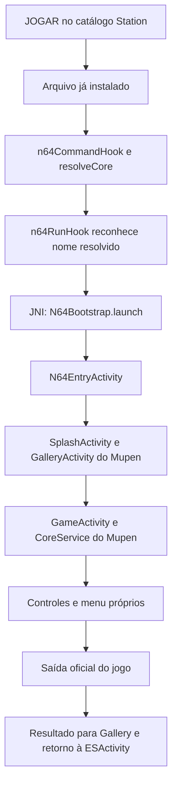

# N64 R19B — funcionamento, reconstrução e diagnóstico

Complemento técnico de 05/10/2026. Escopo: correção da abertura do Nintendo 64 e uso de seus controles/menu próprios no mesmo APK TurboStations. Leia primeiro o [estado e a prova no aparelho](README.md). Este complemento documenta a entrega existente; não gera outra versão do aplicativo.

## 1. Qual versão usar

| Revisão | Conteúdo e estado |
| --- | --- |
| R15 | Incorporou o Mupen64Plus AE completo. A existência das classes/recursos no APK não provava que JOGAR os alcançava. |
| R18 | Base exata usada nesta correção; inclui Neo Geo filesystem, navegação R17 e offline/download R16. |
| R19 | Corrigiu o despacho N64. Na execução real, a galeria fechou por incompatibilidade entre classes visuais. É histórico de diagnóstico. |
| **R19B** | Corrige o despacho e os recursos visuais. Instalada, hash conferido; 007 abriu, e o mantenedor confirmou controles, menu e retorno sem login. |
| Neo Geo CD / R20 visual | Trabalhos separados. Não fazem parte do conteúdo instalado descrito por este snapshot. |

APK R19B arquivado: `G:\BAKUP SISTEMA APP 03-10-2026\apks-candidatos-visuais\TurboStations-N64-Controles-R19B-20261005.apk`.

SHA-256: `c8fcb15f0951cf5874ac9de2fa2f2e9bfbe26813b7e9ddea5b897355cea4157c`. Tamanho: **2.036.265.660 bytes**. [Recibo de arquivamento](evidence/r19b-archive.json): cópia conferida antes de remover somente a duplicata APK em E:. Fontes, testes e recibos continuam em E:.

Pacote instalado: `org.turboramastation.frontend`. Classes Java do frontend: `org.emulationstation.frontend`. Esses nomes diferentes são intencionais; não renomear a classe ou o pacote por inferência.

## 2. Abertura de um jogo

O catálogo/instalador fornece o caminho real do arquivo local. A ponte não baixa ROM, não inventa nome de pasta e não exige copiar o jogo para uma biblioteca paralela. `N64EntryActivity` valida arquivo legível e passa o caminho absoluto pela chave real `ActivityHelper.Keys.ROM_PATH`, obtida da classe upstream. Não atravessa as Activities com uma URI `file://`.

`mupen64plus_ae_android.so` é **um identificador interno de despacho**. Não significa que o jogo deva carregar uma nova biblioteca libretro com esse nome. O hook abre a Activity do Mupen antes da execução libretro. Em caso de falha explícita de abertura, retorna erro; não inicia silenciosamente o motor antigo.

### Mapa do código nativo

Fonte: [native_n64.h](native/native_n64.h).

| Função | Responsabilidade |
| --- | --- |
| `n64PlatformKey` | Aceita `Nintendo 64`, `Nintendo 64 - BR`, `n64`, `n64br`, `nintendo-64`, `nintendo-64--br` pela comparação de identidade já existente. |
| `n64Core` | Primeiro verifica plataforma; para nomes de motor, extrai o último componente do caminho, remove o prefixo `lib` e compara nomes completos. |
| `n64CommandHook` | Produz `libretro: core=mupen64plus_ae_android.so` para a plataforma reconhecida. |
| `openN64` | Carrega a ponte pelo ClassLoader da Activity e chama `launch(Activity,String,boolean)` por JNI. Após despacho aceito, pausa vídeo do sistema e música de menu. |
| `n64RunHook` | Abre o arquivo instalado com `settings=false`; outras plataformas seguem o encadeamento já existente. |
| `n64SettingsHook` | Usa `settings=true` e fecha o painel Station quando a ponte aceita a abertura. |
| `n64DefinitionsHook` | Identifica o painel de configurações próprias do Mupen. |
| `n64FreshHook` / `n64BundledHook` / `n64InstalledHook` / `n64AssetsHook` / `n64PackHook` | Declaram a integração incorporada e dispensam o fluxo antigo de obtenção do core para N64; demais motores são delegados ao encadeamento anterior. |

Nomes de motor reconhecidos após normalização: `mupen64plus_ae_android.so`, `mupen64plus_next_gles3_libretro_android.so` e `mupen64plus_next_gles3`. A compatibilidade com os identificadores antigos encaminha para a integração nova; não restaura os controles antigos. Um diretório chamado N64 contendo o core de outra plataforma não é suficiente para selecionar esse motor.

O erro original foi comprovado no resolvedor da base: ele acrescentava `lib`, e o hook rejeitava o nome resultante. [Desmontagem](evidence/bundled-prefix.txt), [chamada de execução](evidence/resolved-run.txt) e [recibo](evidence/resolver-evidence.json) identificam a base e os endereços examinados.

## 3. Ponte Java, configurações e armazenamento

As classes abaixo já vieram da integração R15 e **seus DEX não mudaram na R19B**:

- [N64Bootstrap.java](../station-emulators-r15-20261005/n64/java/org/emulationstation/frontend/N64Bootstrap.java): valida Android 9/API28 ou superior; separa processos, preferências e armazenamento; abre o jogo ou as configurações; retorna ao frontend.
- [N64EntryActivity.java](../station-emulators-r15-20261005/n64/java/org/emulationstation/frontend/N64EntryActivity.java): recebe `game`/`settings`, prepara o processo e encaminha ao Splash oficial. Falhas exibem mensagem com VOLTAR.

Processo `:n64`: preparação/galeria/configurações. Processo `:n64core`: jogo e serviço do motor. A inicialização da aplicação reconhece esses processos e não executa neles a inicialização geral dos demais emuladores.

Preferências passam por `getSharedPreferences("n64." + name, ...)`. Arquivos privados ficam em `files/n64` e `cache/n64`; arquivos externos privados em `externalFiles/n64`, com alternativa interna quando necessário. O seed cria as pastas e define `gameDataStorageType=internal` **somente se a chave não existir**. Uma escolha posterior do usuário é preservada.

Engrenagem Station → Nintendo 64 → `settings=true` → Gallery oficial → chamada de `onOpenDrawerButtonClicked(View)`. É chamada ao método da tela, sem coordenadas. A execução dessa rota específica pela engrenagem ainda não recebeu conferência visual nesta rodada; o menu dentro do jogo foi confirmado pelo mantenedor.

A saída normal do jogo entrega o resultado à Gallery. Quando ela termina, a ponte abre `org.emulationstation.frontend.ESActivity` com `CLEAR_TOP | SINGLE_TOP`, fecha suas próprias telas e encerra seu próprio processo de interface após 350 ms. O CoreService mantém o encerramento upstream. O retorno sem pedir login foi confirmado; a correção não cria outra sessão de autenticação.

### Botões que somem quando não há toque

O upstream `GlobalPrefs` usa `touchscreenAutoHideEnabled=true` e `touchscreenAutoHideSeconds=5` como valores padrão. O perfil padrão de toque é `Analog`, com possibilidade de perfil D-pad conforme o jogo. A ausência de botões numa captura após inatividade não demonstra que os controles faltam. No aparelho, o mantenedor confirmou que os controles aparecem e respondem. Nenhuma preferência foi forçada apenas no telefone para obter esse resultado.

## 4. Por que a R19 fechava e como a R19B corrige

As dependências de interface do Mupen estão realocadas sob `tn64core.shaded`, e os recursos têm prefixo `n6_`. Algumas strings e propriedades XML ainda apontavam para `com.google.android.material...` do frontend. A inflação da galeria tentou usar um comportamento da família antiga dentro de um `CoordinatorLayout` da família realocada e lançou `ClassCastException`.

Arquivos corrigidos: [n6_strings.xml](resources/res/values/n6_strings.xml) e [n6_styles.xml](resources/res/values/n6_styles.xml). As sete strings de comportamento receberam `tn64core.shaded.`; quatro estilos `Base.V14.Theme.MaterialComponents` e suas variantes Dialog/Light receberam a classe realocada de `MaterialComponentsViewInflater`. [Lista exata das 11 alterações](evidence/resource-tests.json), [IDs dos recursos compilados](evidence/compiled-resource-tests.json).

[merge_resources.py](recipes/merge_resources.py) também foi corrigido para realocar referências de classe no **texto e nos atributos XML** durante importações futuras. Aplicar somente os dois XML a uma árvore atual corrige esse build, mas reutilizar o importador antigo numa integração refeita reintroduziria o defeito.

## 5. Entradas necessárias para reconstruir

| Entrada | Caminho/prova |
| --- | --- |
| Fontes e produtos R19B | `E:\ESTUDO APK\work\station-n64-controls-r19-20261005` |
| Quatro fontes de overlay | `native/` deste snapshot; usar seu cpp junto de `native_n64.h`, `native_folders.h` e `native_search_download.h` |
| Demais headers, `video720_posters.o` e bibliotecas de ligação `libc.so`, `libdl.so`, `liblog.so` | `E:\ESTUDO APK\work\station-download-performance-20261005\frontend-native` |
| Árvore completa de recursos anterior | `E:\ESTUDO APK\work\station-n64-complete-20261005\merged\res` |
| Manifesto e configuração do apktool | `...\station-n64-complete-20261005\merged\AndroidManifest.xml` e `apktool.yml` |
| Mapa de classes e framework apktool | `...\station-n64-complete-20261005\resource-map.json` e `framework` |
| Fonte anterior para o teste negativo de despacho | `before/native_n64.h` deste snapshot |
| Teste de navegação | `tests/navigation.cpp` deste snapshot; a receita original aponta para `station-single-folder-r17-20261005/tests/navigation.cpp` |
| Base privada para reproduzir R19B | `G:\BAKUP SISTEMA APP 03-10-2026\apks-candidatos-visuais\TurboStations-NeoGeo-Pastas-R18-20261005.apk`; SHA `a29151da312830d826f6ea71ebb61cb8a39fe1c21786f719e26a61568b29b1c4` |
| Ferramentas | NDK r28c em `E:\TurboEdenEngine`; LLVM host em `C:\Program Files\LLVM\bin`; JDK17 em `C:\Program Files\Eclipse Adoptium\jdk-17.0.20.101-hotspot\bin`; apktool3.0.3 em `E:\ESTUDO APK\TurboRetroEmu-build\tools`; aapt2/apksigner/zipalign em `E:\ESTUDO APK\TurboRetroEmu-build\android-build-tools\35.0.0\android-15` |
| Certificado | Deve ser o certificado original, SHA `7b16ee1aca7db7a50e7cc6c8612cf2a3568f474894a468865d842bf720c89825`; chave privada permanece no PC |

**O Git desta entrega contém o delta de fontes, receitas e provas; os dois XML não constituem o projeto Android inteiro.** Para reproduzir o delta R19B, são necessários a base R18, os recursos completos já preparados, objetos de mídia, dependências e chave de assinatura locais. O donor oficial é necessário se for refazer a integração R15 integral, não precisa ser importado novamente para esse delta. A [integração R15](../station-emulators-r15-20261005/BUILD.md) documenta essa origem; uma nova execução de seu fluxo precisa usar o importador corrigido e preservar as revisões posteriores. Não substituir R19B por um build R15 antigo.

### Ordem de reprodução da R19B

1. Preparar uma **pasta nova em E:**, mantendo a árvore congelada. As receitas têm caminhos absolutos; revisar entradas e saídas individualmente. `W` é a pasta da nova montagem; `P` em `fix_n64_resources_r19b.py` é o projeto temporário, mas **`U` nesse script é a entrada R15 congelada**. Já no empacotador, `O` é o APK final e **`U` é o APK unsigned de saída**. Adaptar também os caminhos dos testes. São registros da montagem realizada, não um comando portátil já validado para qualquer checkout.
2. Copiar os quatro fontes nativos finais, `before/native_n64.h` e testes. Usar as dependências R16 indicadas. `test_build_n64_controls_r19.py` contém a compilação C++17/O2 ARM64/API26/16KiB e os testes de despacho/navegação. API26 da biblioteca não reduz o requisito API28 do emulador Android completo.
3. Reconstruir os recursos com `fix_n64_resources_r19b.py`: copiar a árvore completa `merged/res` e os dois arquivos de projeto, aplicar as 11 correções pelo mapa de classes, compilar com apktool/aapt2 e extrair `resources.arsc`. Não criar um projeto contendo somente `n6_strings.xml` e `n6_styles.xml`.
4. Executar a comparação de `verify_archive_n64_resources_r19b.py` com a base R18: IDs/nomes idênticos; exatamente 11 valores modificados. Essa receita também arquiva um APK intermediário, portanto revisar os destinos de arquivo antes de reutilizá-la.
5. Empacotar com **`package_n64_controls_r19b.py`**. Substituições permitidas sobre R18: `lib/arm64-v8a/libturbo_carousel.so` e `resources.arsc`. **`package_n64_controls_r19.py` é histórico e gera a revisão com o conflito de recursos.**
6. Conferir alinhamento, certificado e hashes de todas as entradas. A montagem executada preservou 13.079 entradas e todos os DEX/motores. Gerar recibos novos para qualquer reconstrução; timestamps podem mudar o SHA do ZIP final.
7. Somente quando houver uma nova instalação necessária, atualizar com `adb install --no-incremental -r --user 0 <apk>` e conferir o SHA do `base.apk`. Não desinstalar nem limpar dados. Registrar abertura, controles, saída e limites da conferência.

O diretório temporário `resource-project` já foi removido após a comparação; ele precisa ser recriado pela etapa 3 numa nova pasta. O APK intermediário de recursos foi arquivado em `G:\BAKUP SISTEMA APP 03-10-2026\binarios-compilados\station-n64-controls-r19-20261005\n64-resources-r19b.apk`, SHA `afa2871d558919c6e3ea55769711b941be71710d70ae1f8d0c5f7b5e60fd7b59`. O `resources.arsc` final continua em E:, SHA `1e33730bf8fc2b7bd4c6994c2254b2dffb3e44fff8b359e22a51627dde9103dd`.

O SO final também foi arquivado para liberar espaço: `G:\BAKUP SISTEMA APP 03-10-2026\binarios-compilados\station-n64-controls-r19-20261005\libturbo_carousel.so`, 85.293.984 bytes, SHA `e0f13c18e0f6c4efe8e1d279422f9ed5516bd4f8cc21b7df1cf0ab1406fd248c`. O [recibo](evidence/native-output-archives.json) também registra a saída compilada R16 arquivada. Esses dois SO são produtos de compilação; os stubs `libc.so`/`libdl.so`/`liblog.so`, headers e `video720_posters.o` usados para reconstruir permanecem em E:. Ao reaproveitar um SO já compilado, a receita precisa apontar para seu caminho arquivado e conferir seu SHA; ao recompilar, escrever na nova pasta em E:.

### Próxima funcionalidade é uma operação diferente

Para reproduzir **esta revisão**, a receita usa R18. Para integrar **uma funcionalidade posterior**, a base passa a ser **R19B** ou uma sucessora conferida que a preserve. Adaptar as guardas de hash e a lista explícita de entradas do novo pacote. Não executar uma receita que reconstrua sobre R18 e assim descarte `resources.arsc`/carousel corrigidos. O delta Neo Geo CD remoto permanece separado e requer essa conciliação antes de qualquer empacotamento.

## 6. Evidência disponível e limites

| Verificação | Resultado/documento |
| --- | --- |
| Despacho N64 | 240 verificações C++; o código anterior é rejeitado pelo mesmo teste — `evidence/tests.json` |
| Navegação herdada | 3.030 verificações C++ de pastas/retorno — `evidence/navigation.log` |
| XML | 80.125 verificações; XML não N64 byte idêntico — `evidence/resource-tests.json` |
| Recursos compilados | 43.618 recursos comparados; apenas 11 referências N64 alteradas — `evidence/compiled-resource-tests.json` |
| APK | Assinatura, 16KiB e entradas conferidos — `evidence/build-result-r19b.json` |
| Instalação | Atualização preservando dados, hash igual — `evidence/installation-r19b.json` |
| Aparelho | 007 em GameActivity/CoreService próprios; controles/menu/retorno confirmados pelo mantenedor — `evidence/n64-device-result.json` |

`installed: false` no recibo de **build** corresponde ao instante anterior à instalação. O recibo de **instalação** é posterior. A prova do telefone não é um teste de todos os jogos, nem uma medição de FPS, nem uma reconstrução limpa independente do ambiente original. A USB caiu após a captura inicial; separar captura/log de confirmação do mantenedor.

As 240 verificações compilam as funções reais de seleção e despacho com `openN64` substituído por um simulador controlado. Elas exercitam aliases, normalização, delegação e retorno de falha; não executam JNI, Activities ou controles Android. A chamada real ao emulador é sustentada pela evidência separada do telefone. Os testes de navegação e XML também não medem gameplay.

## 7. Diagnóstico sem adivinhar

| Sintoma | Conferir primeiro |
| --- | --- |
| Voltam controles do frontend | Hash do APK/SO, identificador resolvido real e log `TurboN64`; confirmar se o hook alcançou a ponte. |
| Fecha ao montar a galeria | Exceção completa, `n6_appbar_scrolling_view_behavior`, classes `tn64core.shaded` e SHA do `resources.arsc`; não assumir que seja a ROM. |
| Mensagem de arquivo indisponível | Caminho instalado passado à ponte e legibilidade do arquivo; não substituir pelo nome do catálogo. |
| Controles não visíveis numa captura parada | Tocar na tela e conferir perfil/auto-hide nas configurações próprias antes de concluir ausência de controles. |
| Pede login ao retornar | Registrar Activities/resultados/retorno à ESActivity e estado da sessão; não apagar licença/dados como diagnóstico. |

Nenhuma alteração de servidor foi necessária para os dois defeitos aqui demonstrados. Correções futuras devem continuar entrando no código/APK; um ajuste manual no telefone não substitui uma entrega reproduzível.
